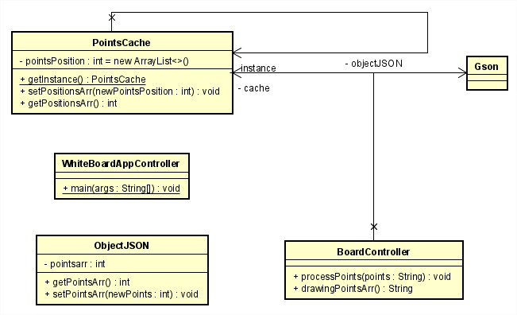
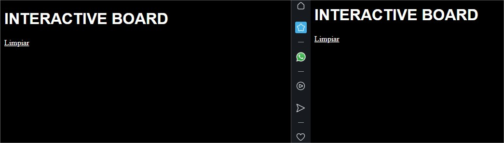
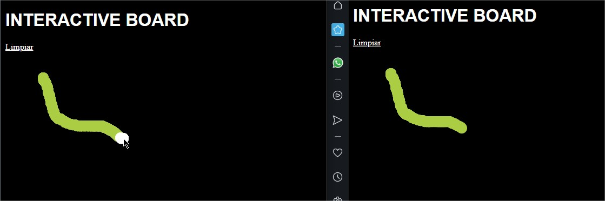
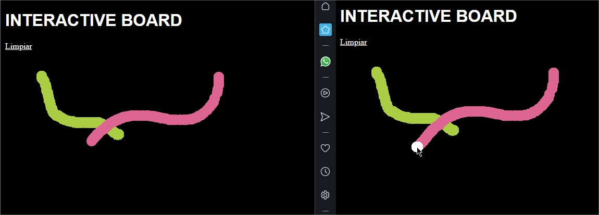
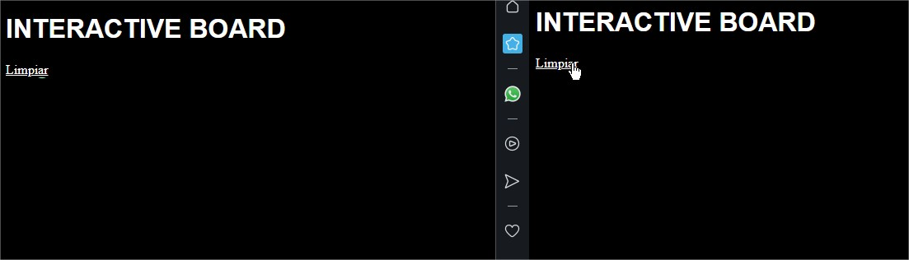
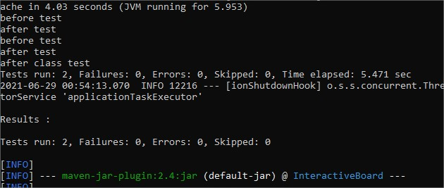

## Tablero Multiusuario
### Miguel Ángel Rodríguez Siachoque
### 28 de Junio de 2021

## Tablero Multiusuario - HeokuApp

## Paquete Datagram
 
#### Descripcion WhiteBoardAppController
Esta clase principal se encarga de la activacion del letrero para que pueda ser ejecutado en el puerto indicado con Spring.
#### Descripcion PointsCahce
Esta clase se encargada de guardar los puntos de los usuaris en listas para poder ser dibujadas posteriormente en el tablero y ser visible.
#### Descripcion BoardController
Esta clase controla la parte de la organización de las listas donde se identifican la ubicacion de los puntos de los usuarios para posteriormente ser mostrardos junto a ___cache___.
#### Descripcion ObjectJSON
Esta clase se encarga de la lectura de los puntos, obtenerlos para que las clases, metodos y funciones puedan entender la informacion de los usuarios.
#### Descripcion Gson
Esta se encarga de generar las listas de puntos como objetos para ser mejor manejadas por las clases.
#### Descripcion WebController
Este programa de JavaScript tiene funciones:
- ___checkPoints:___ Verificar de puntos a dibujar.
- ___getPointsArr:___ Obtencer de puntos a dibujar.
- ___setup:___ Realiza el entorno del tablero.
- ___draw:___ Realiza el dibujo de puntos mediante la acción del mouse.
- ___newDrawPoints:___ Realiza el dibujo de los puntos de otros usuarios visitantes en el tablero local.

## Ejecucion
 
> - Se ingresar, en este caso se tendran dos ventanas para mostrar el caso de dos usuarios. 
 
> - Se verifica que el ___usuario#1___ pueda dibujar y se vea en el tablero del ___usuario#2.___
 
> - Se verifica que el ___usuario#2___ pueda dibujar y se vea en el tablero del ___usuario#1.___
 
> - Se verifica el funcionamiento del boton de ___Limpiar___ para la limpieza de las pantallas.

## Test
 
> - 2 pruebas test y la ejecución de antes y despues de la aplicación.

## JavaDoc:
[JavaDoc - HerokuApp](JavaDoc/index.html)

## Tiempo de Lineas LOC
- ___WhiteBoardAppController:___ 
11 lineasLOC. 
- ___PointsCahce:___ 
21 lineasLOC. 
- ___BoardController:___ 
24 lineasLOC. 
- ___ObjectJSON:___ 
14 lineasLOC. 
- ___WebController:___ 
59 lineasLOC. 
- ___Index:___ 
16 lineasLOC. 
### Tiempo total
___229/23 = 9.96 lineasLOC/hora.___
